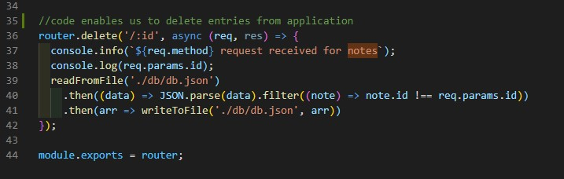
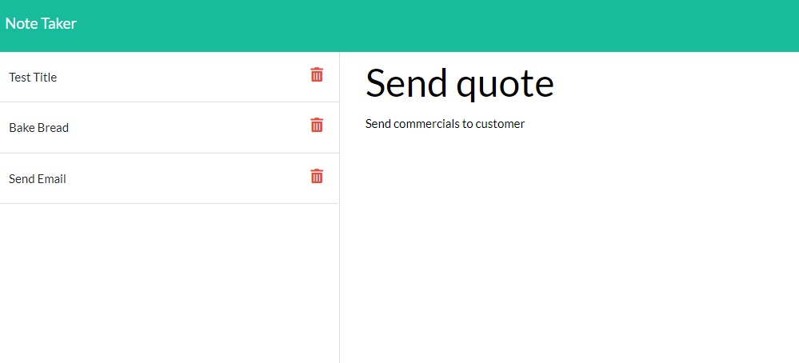

# Note-taker
A batch of code that presents a digital exercise book for writing and storing notes

## Description 

This week, we built an application that makes it easier to load and store notes / activities we would refer to during our workday. 
The application saves notes we populate into the search field and gives the user an ability to remove notes upon clicking the recycling bin icon and refreshing the page. 

## Installation

Users can access this application with Heroku which has been linked to this repo. 
Users can run the code in node.js and source the localhost 3002 domain to access the application. 

## Usage

You can use this application to host important notes used within a workday. 
The application links various files across our directory, including:
db.json files
module files (ie, index.js, notes.js)
public domain (ie, html, css and javascript)
require 
express

## Lessons

Map files
Using routing
Deploying middleware 
Syncing db.json files with broader code
Adding notes to the application by parsing multiple functions
Adding the delete function (upon refresh) so notes can be removed
Deploying to Heroku and linking this to git hub account

code we used to deploy the delete function, enabling users to remove their entries upon refresh of page

example of application in action... notes are written and then saved to left column. upon clicking each note item, the notes are populated in the right field.

## Heroku link to deployed application

https://vast-everglades-88551.herokuapp.com/

## Contributors

https://github.com/oscarcbryant

## Conclusion
This was a light project which enabled us to practice routing and mapping files to improve usability of our code. 
Routing programming will be very useful in future when our code is larger and more complex. 
This exercise was thus highly useful in understanding the fundamentals of routing with express.

## Questions
If you would like to know more, please contact me via the details below:

Github account:

https://github.com/oscarcbryant

Email:

oscarcbryant@gmail.com

